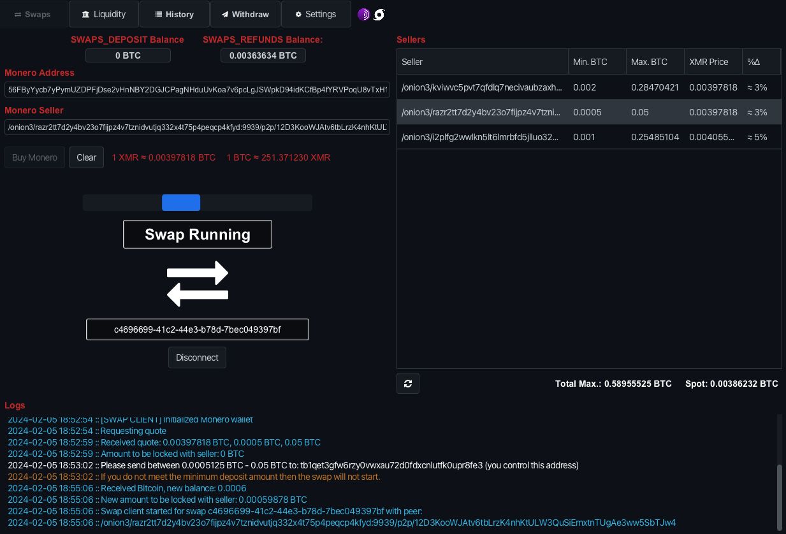

# SAMOURAI SWAPS

The Samourai Atomic Swaps program is currently in beta. Swaps are functional, but the UI has NOT been finalized and is very "dev UI", and there are still some bugs that need to be ironed out. Swaps CAN fail, for multiple reasons. It is important you ensure your swap remains running, otherwise you risk being punished. <insert link here about punish tx>

The reason for this is that the swaps program is currently being built up into a much larger project, code-named CARAVAN. The finalized UI will be implemented then, and will become an extremely versatile BTC<->XMR wallet tool.

Learn more about selling XMR by running the Automated Swap Backend [here](SELL_XMR.md).

Learn more about building and running the program [here](../README.md).

Learn more about configuring the settings [here](SETTINGS.md).

Learn more about swaps architecture [here](SWAPS.md).

[FAQ](./docs/FAQ.md)

# Getting Started

## Pairing

Upon launching the application for the first time, you will be prompted to enter your Samourai Wallet pairing payload. This is no different than how you would pair with Whirlpool CLI/GUI.
[Whirlpool Pairing Documentation](https://docs.samourai.io/whirlpool/desktop)

**Note: Pairing with Testnet Samourai pairing payload will initialize app configuration to Testnet/Stagenet**

 
 

## Starting a Swap: Swapping Bitcoin (BTC) to Monero (XMR)

Once paired, you will be greeted with the following screen (see screenshot below).

This is the "Swaps" tab. Here you can find a list of sellers, and initiate swaps with them.

To initiate a swap from Bitcoin to Monero, simply browse the list of sellers for an offer you find acceptable, then enter a Monero address and click "Buy XMR". Note the minimum and maximum BTC you are able to swap with them, and the price of the XMR.

 

## Depositing Bitcoin

When clicking "Buy XMR", your client will ensure the peer is still online, then display a Bitcoin address to deposit your coins to. Do not worry, this address is absolutely, 100%, in your own control. It exists on a new derivation path in your Samourai Wallet. <link updated deriv account values>

Simply send your Bitcoin to the address, making sure to set a sufficient fee to be confirmed quickly, and that the amount is within the minimum and maximum.
Once the Bitcoin is in the deposit address, the client will setup a swap with the peer. This involves setting up a few transactions:

- Bitcoin lock transaction
- Bitcoin redeem transaction
- Bitcoin cancel/refund transaction
- Bitcoin punish transaction

The flow of transcations are explained more in depth on this page or else a summary can be found [here](FAQ.md#what-is-the-flow-of-transactions)

If you are using Tor, sometimes Tor can be slow/unstable, and this process can stall/fail. No need to worry, if no lock transaction has been broadcast you can simply cancel/disconnect from the swap and either restart or start a new one with another peer.

If a lock transaction has been broadcast, then you will be able to cancel and refund your Bitcoin when the Bitcoin lock transaction has 72 confirmations, minus transaction fees.

 

## The Bitcoin lock transaction

Once the setup process with the peer finishes, a Bitcoin lock transaction is broadcast to the network. This locks your Bitcoin with the peer until the swap either completes or fails.

Upon confirmation of the Bitcoin lock transaction, your trading partner should lock their Monero and respond with the lock proof.

## The Monero lock transaction

Once the Monero lock transaction has been broadcast, your client will begin watching for confirmations of the transaction. Once 10 confirmations have been reached, your client will send a Bitcoin transaction signature to the peer that they can use to broadcast the Bitcoin redeem transaction.

If the Monero lock transaction never confirms, then the swap will eventually be canceled and your Bitcoin will be refunded, as long as you keep the swap resumed within the program.

If, for whatever reason (internet connection issues, power outages, etc.), your trading partner does NOT publish the Monero lock transaction, then do not worry. As long as you keep the swap running your Bitcoin will be refunded once the cancel transaction can be broadcast (by default, this is when the lock transaction has 72 confirmations), regardless of the peer being online or not.

## The Bitcoin redeem transaction

Once the transaction signature has been received by your trading partner, they will be able to broadcast the Bitcoin redeem transaction. This transaction releases the Bitcoin from the lock transaction, moving the coins to a wallet entirely controlled by your trading partner.

The broadcast of the redeem transaction instantly reveals the necessary key data needed to redeem the Monero on your end. Your trading partner will not be able to take back the Monero themselves at this point, and it is not necessary to redeem the Monero immediately, but it is recommend to sweep the coins into a wallet you're more comfortable with. The program handles this for you automatically upon broadcast of the Bitcoin redeem transaction using the Monero address provided at the start of the swap.

Congrats! You've completed your first BTC->XMR atomic swap!

"But wait, what if something goes horribly wrong during the swap? Like a power outage, or internet outage, or your trading partner disappears into the sunset, or a nuclear apocalypse starts?"

In the event that something breaks or crashes during a swap, do not worry. As long as you can maintain an internet connection on your end, and you aren't doing anything crazy to corrupt your system, you will be fine. As long as the swap remains running in the program, either from when you clicked "Buy XMR" or resuming from the "History" tab, you will be refunded if something goes wrong, even if your trading partner vanishes into thin air.

## The Bitcoin cancel/refund transactions

By default, when the Bitcoin lock transaction reaches 72 confirmations, and the redeem transaction has not been broadcast, both participants can broadcast the Bitcoin cancel transaction. The name is rather self-explanatory: it cancels the atomic swap.

When this is broadcast, you are incentivized to broadcast the refund transaction as soon as possible, even immediately upon broadcast of the cancel transaction. You will not be receiving any Monero, but you can get your Bitcoin back, minus transaction fees. The program handles this for you by default as long as the swap is resumed/running.

When the refund transaction is broadcast, this reveals the necessary data your trading partner can use to refund their Monero to their wallet.

Failing to broadcast the Bitcoin refund transaction can result in you losing your Bitcoin to your trading partner, while the Monero remains locked. This occurs when your trading partner broadcasts the Bitcoin punish transaction.

## The Bitcoin punish transaction

By default, the Bitcoin punish transaction can only be broadcast once the Bitcoin cancel transaction has 72 confirmations, and no refund transaction has been broadcast or confirmed. This means you, the buyer, have until the Bitcoin lock transaction has almost 144 confirmations to broadcast the Bitcoin refund transaction, so it is recommended to broadcast as soon as possible (when the lock transaction has 72 confirmations).

When this refund transaction is broadcast, the Bitcoin is sent to a wallet fully controlled by your trading partner, and the Monero remains completely locked and unspendable by both parties without additional cooperation (not yet implemented).

## Resume Swap

Most of the time the app will auto resume swaps when problems occur. If you need to manually resume a swap though, this can be done from the "History" tab. Simply click on the swap you wish to resume.

