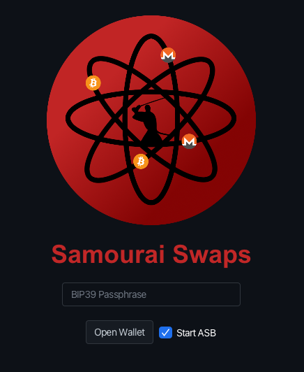
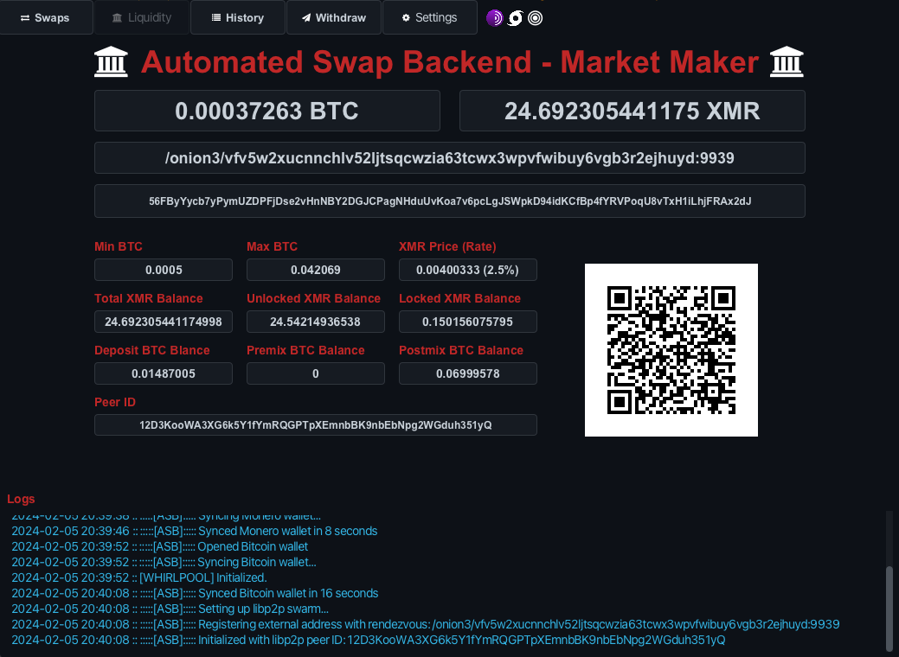

# Automated Swap Backend (ASB) - Market Maker / Liquidity Provider

In order to sell XMR and be a Market Maker / Liquidty Provider, one must run the Automated Swap Backend (ASB). 

Learn more about using the GUI [here](BUY_XMR.md).

Learn more about building and running the program [here](../README.md).

Learn more about configuring the settings [here](SETTINGS.md).

Learn more about swaps architecture [here](SWAPS.md).

[FAQ](FAQ.md)

## Getting Started

Upon launching the application, you will be prompted to pair your Samourai Wallet or simply to login and open wallet if already paired. If you want to sell XMR, you must check the checkbox 'Start ASB'.

 

The Automated Swap Backend will then be visible on the 'Liquidty' page. You will need to leave the program running in order for people to start swaps with you, so you can swap your Monero to Bitcoin.

### Balances

Your BTC Balance is shown for XMR sold. Your XMR Balance is what you deposited and available to sell.

### Seller Address

Your Seller Address is shown for what you'll appear as on the Sellers table list.

### Deposit XMR

Your ASB's XMR address will be displayed where you can deposit XMR to sell.

### Other Balances

The smaller balances again shows your deposited XMR balance which is the total of the unlocked and locked XMR balances.

The additional BTC balances are from your paired Samourai Wallet. It displays the Deposit, Premix, & Postmix Balances. The large BTC balance on top is segregated to its own derivation path for the Swap ASB and not part or these BTC balances. It is seperate from Deposit but is also unmixed.

### Configs

The ASB Settings Configs are also displayed.

These can be adjusted from the 'Settings' [page](SETTINGS.md). You can set the minimum, maximum, and fee rate.

You can also turn on Auto Tx0 to automatically whirlpool acquired BTC from XMR sales. You can set pool size and apply an SCODE as well.

**CAUTION: Auto Tx0 may potentially combine utxos to meet pool size threshold which can link ownership.** 

### Peer ID

The Peer ID is also displayed.