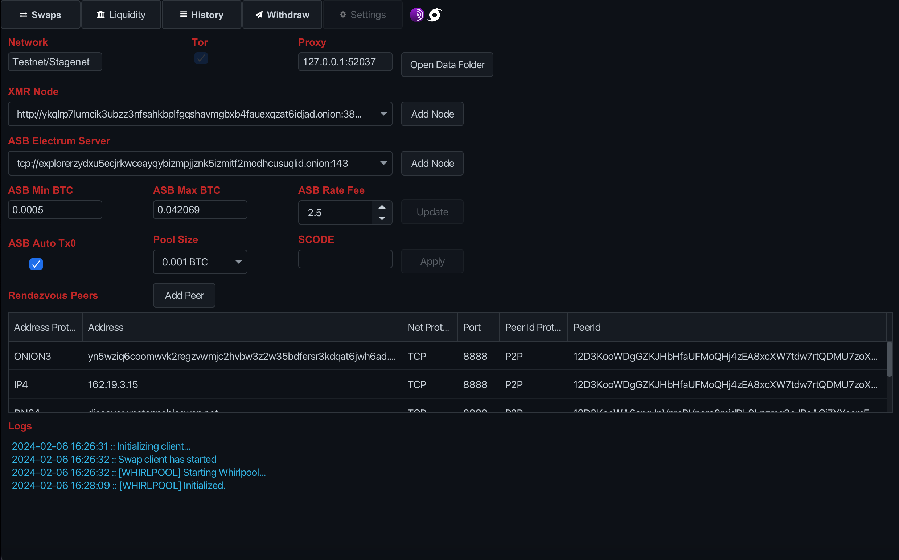

# SETTINGS

The config settings can be set in the "Settings" tab.

Learn more about using the GUI [here](BUY_XMR.md).

Learn more about building and running the program [here](../README.md).

Learn more about selling XMR by running the Automated Swap Backend [here](SELL_XMR.md).

Learn more about swaps architecture [here](SWAPS.md).

[FAQ](FAQ.md)

### NETWORK

Whether using Mainnet or Testnet/Stagenet is displayed.

### TOR

The app is routed over TOR. The ability to use over clearnet might be added as an option later on in the future.

ASB Tor Config can be found in the following locations:  
**Linux:** `~/.local/share/samourai-swaps/tor-v13.0.6`  
**macOS:** `/Library/Application Support/samourai-swaps/tor-v13.0.6`  
**Windows:** `%APPDATA%/samourai-swaps/data/tor-v13.0.6`

The "v13.0.6" comes from the Tor Browser version, tor binary is 0.4.8.9.

You can also replace the `/tor-v13.0.6/hiddenservice/asb-onion` private keys and onion hostname with your own if you want.

### PROXY

The app's proxy is displayed.

### OPEN DATA FOLDER

The "Open Data Folder" button opens the folder where all the app's data and configurations are stored.

### XMR NODE

Select from list of XMR nodes or add your own.

### ASB ELECTRUM SERVER

For the Automated Swap Backend, select from list of Electrum servers or add your own.

### ASB MIN, MAX, RATE FEE
withdraw
For the Automated Swap Backend, set the MIN & MAX BTC as well as the rate fee (premium).

### ASB AUTO TX0

For the Automated Swap Backend, you can have it auto Tx0 & Whirlpool your earned BTC. It is off by default but can be enabled. The minimum pool size can be set and SCODEs can be applied.
**Caution: Enabling may potentially combine utxos in order to meet pool size threshold which may link ownership.**

### RENDEZVOUS PEERS

Automated Swap Backends are registered with Rendezvous Peers to become public on the sellers list. There are currently 5 main known ones, but additional ones can be added.
