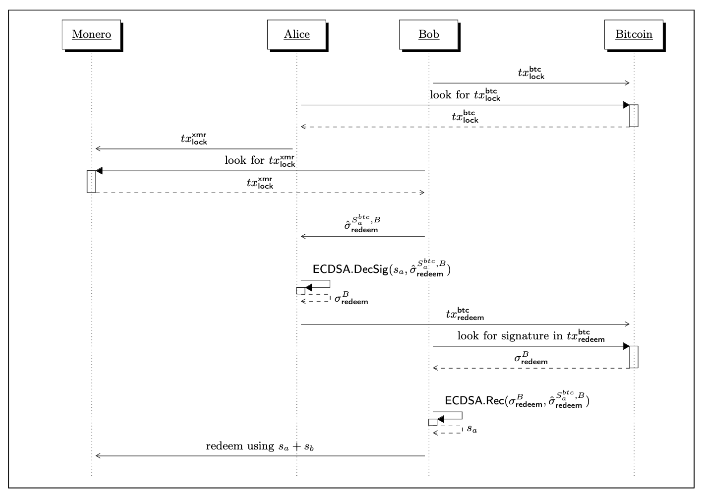
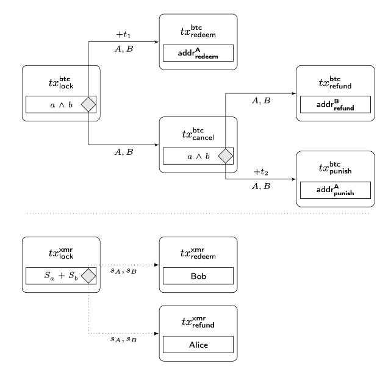

# XMR-BTC Atomic Swaps

## Samourai development

Samourai is currently developing a Java FOSS platform agnostic client library which replicates COMIT 'swap' CLI functionality and dialogs with COMIT 'asb' (see below).

A GUI for COMIT XMR-BTC atomic swaps with modifications to further enhance anonymity, with the Automated Swap Backend (ASB) built-in, as well as Whirlpool for automatic mixing of redeemed BTC.

The Samourai Atomic Swaps program is currently in beta. Swaps are functional, but the UI has NOT been finalized and is very "dev UI", and there are still some bugs that need to be ironed out. Swaps CAN fail, for multiple reasons. It is important you ensure your swap remains running, otherwise you risk being punished. <insert link here about punish tx>

The reason for this is that the swaps program is currently being built up into a much larger project, code-named CARAVAN. The finalized UI will be implemented then, and will become an extremely versatile BTC<->XMR wallet tool.

Samourai Wallet has no plans to incorporate XMR and will remain a BTC-only wallet.

Samourai is currently maintaining 2 XMR nodes:
* Mainnet: 212.129.30.102, RPCs open, including Tor
* Stagenet: 162.19.3.15, being used for XMR-BTC swaps testing.

Learn more about building and running the program [here](../README.md).

Learn more about getting started with the Swaps GUI [here](BUY_XMR.md).

[FAQ](FAQ.md)

## XMR-BTC atomic swaps current landscape

### COMIT

COMIT has published two tools for XMR-BTC atomic swaps:

* 'swap': CLI app for selling BTC in exchange for XMR.
* 'asb': CLI app that acts as a XMR liquidity provider.

Both tools are written in Rust. The latest updates (0.11.1) are dated 17 Nov 2022.

The COMIT whitepaper provides the technical details on their implementation (see [below](#white-papers)).

[COMIT github repo](https://github.com/comit-network/xmr-btc-swap)

[COMIT Monero-Bitcoin Atomic Swap Blog Post](https://comit.network/blog/2020/10/06/monero-bitcoin/)

#### On-chain Protocol

#### TX Schema

### Farcaster

The whitepaper written by Joel Gugger (*h4sh3d@protonmail.com*) served as a basis for Farcaster development. Farcaster tools are more numerous but as of yet there have been no services identified building on top of them. Farcaster swap tools are written in Rust.

[Farcaster github repo](https://github.com/farcaster-project)

### White Papers

The two above mentioned whitepapers have been uploaded to this repo:

[Atomic Swaps between Bitcoin and Monero](./files/Atomic_Swaps_between_Bitcoin_and_Monero-COMIT.pdf) (COMIT)
 
[Bitcoin-Monero Cross-chain Atomic Swap](./files/Bitcoin–Monero_Cross-chain_Atomic_Swap.pdf) (Farcaster)